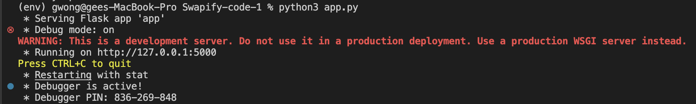

# Swapify-code
## Structure
For the front end of our project, we used HTML/CSS. For the back-end, we used a framework called Flask, which uses the Python programming language.
## How to get the project running
To ensure that the project runs smoothly locally, here are the instructions:
1. If Python has not been installed, [this page](https://www.python.org/downloads/) will guide you in installing it.
2. Pip is required to install Flask. If you 
2. Clone the repo into a local directory. [This page](https://pip.pypa.io/en/stable/cli/pip_install/) will guide you in installing it.
3. Make sure you have some type of software that supports HTML, CSS, and Python. We decided to use VSCode.
4. Start installing Python flash command lines by entering these steps into a terminal:
```
    pip3 install virtualenv
    virtualenv env
    source env/bin/activate
    pip3 install flask flask-sqlalchemy flask-login
    python3 app.py
```
5. If the steps are done correctly, you should see this pop up:

6. Lastly, type in `localhost:5000` in your browser to run the frontend webpages.


