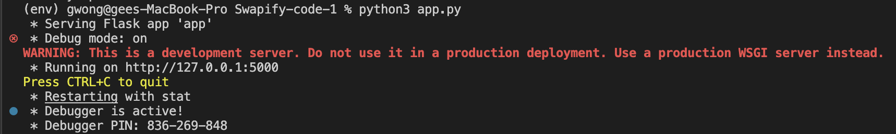

# Swapify-code
## Structure
For the front-end of our project, we used HTML/CSS. For the back-end, we used a framework called Flash, which uses python.
## How to get the project running
To ensure that the project runs smoothly locally, here are the instructions:
1. Clone the repo into a local directory.
2. Make sure you have some type of software that supports html, css and python. We decided to use VSCode.
3. Start installing python flash command lines by entering these steps into a terminal:
    - pip3 install virtualenv
    - virtualenv env
    - source env/bin/activate
    - pip3 install flask flask-sqlalchemy
    - python3 app.py
4. If the steps are done correctly, you should see this pop up: 